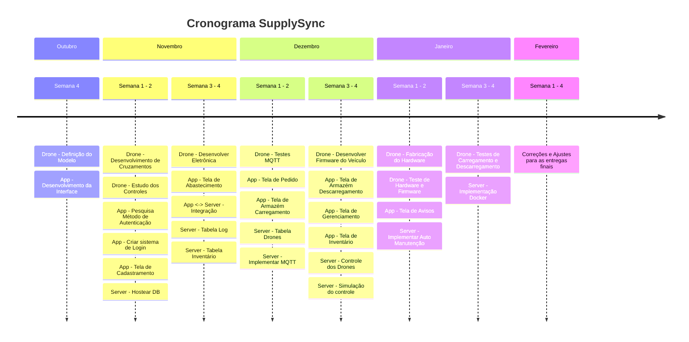

# Cronograma

Abaixo consta o planejamento de atividade dos integrantes da equipe.

## Timeline


```mermaid

timeline

    title Cronograma SupplySync
    section Outubro
        Semana 4: Drone - Definição do Modelo : App - Desenvolvimento da Interface

    section Novembro
        Semana 1 - 2: Drone - Desenvolvimento de Cruzamentos 
                    : Drone - Estudo dos Controles
                    : App - Pesquisa Método de Autenticação 
                    : App - Criar sistema de Login
                    : App - Tela de Cadastramento
                    : Server - Hostear DB

        Semana 3 - 4: Drone - Desenvolver Eletrônica
                    : App - Tela de Abastecimento
                    : App <-> Server - Integração
                    : Server - Tabela Log
                    : Server - Tabela Inventário

    section Dezembro
        Semana 1 - 2: Drone - Testes MQTT
                    : App - Tela de Pedido
                    : App - Tela de Armazém Carregamento
                    : Server - Tabela Drones
                    : Server - Implementar MQTT

        Semana 3 - 4: Drone - Desenvolver Firmware do Veículo
                    : App - Tela de Armazém Descarregamento
                    : App - Tela de Gerenciamento
                    : App - Tela de Inventário
                    : Server - Controle dos Drones
                    : Server - Simulação do controle

    section Janeiro
        Semana 1 - 2: Drone - Fabricação do Hardware
                    : Drone - Teste de Hardware e Firmware
                    : App - Tela de Avisos
                    : Server - Implementar Auto Manutenção

        Semana 3 - 4: Drone - Testes de Carregamento e Descarregamento
                    : Server - Implementação Docker

    section Fevereiro
        Semana 1 - 4: Correções e Ajustes para as entregas finais
```

## Kanban

```
kanban
  column1[Column Title]
    task1[Task Description]
```