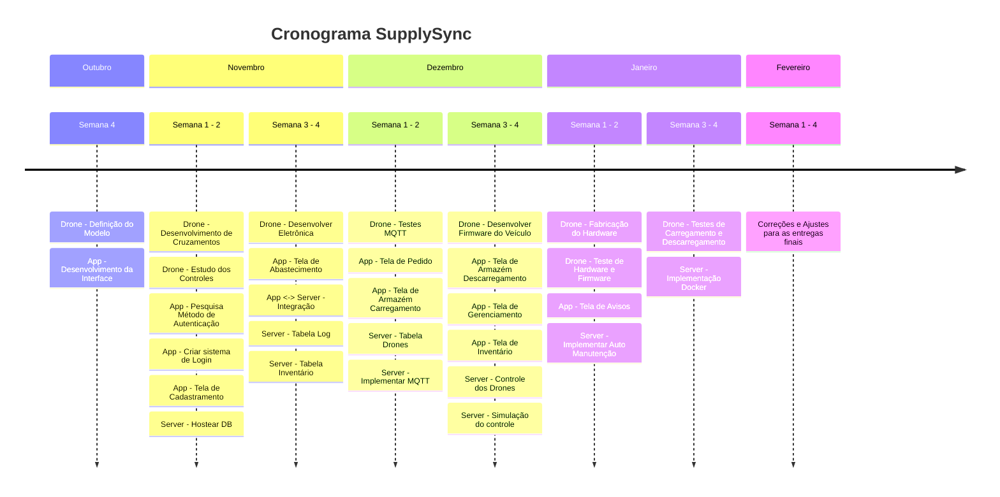
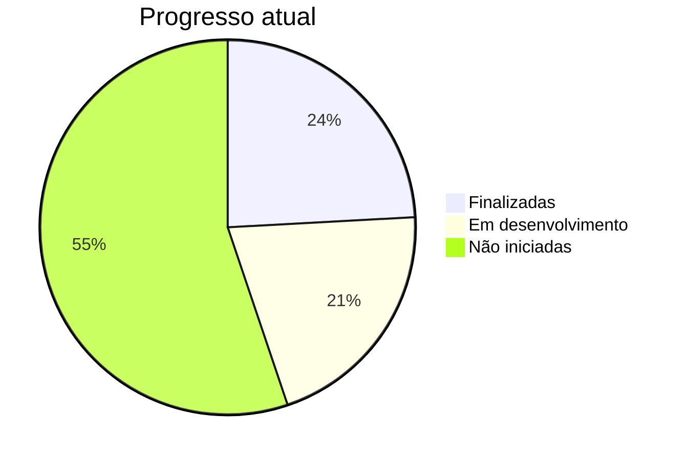
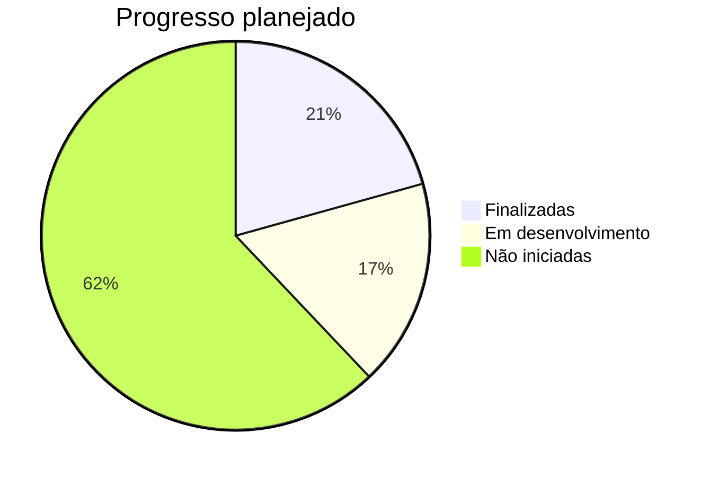

# Cronograma

Abaixo consta o planejamento de atividade dos integrantes da equipe.

## Timeline

## Atividades e acompanhamento

### Drone

- [ ] Desenvolvimento de Cruzamentos - Em andamento
- [X] Estudo dos Controles 
- [ ] Desenvolver Eletrônica - Em andamento
- [ ] Testes MQTT
- [ ] Desenvolver Firmware do Veículo
- [ ] Fabricação do Hardware
- [ ] Teste de Hardware e Firmware
- [ ] Testes de Carregamento e Descarregamento

### App

- [X] Pesquisa Método de Autenticação 
- [X] Criar sistema de Login
- [X] Tela de Cadastramento
- [ ] Tela de Abastecimento - Em andamento
- [X] App <-> Server - Integração
- [ ] Tela de Pedido - Em andamento
- [ ] Tela de Armazém Carregamento
- [ ] Tela de Armazém Descarregamento
- [ ] Tela de Gerenciamento
- [ ] Tela de Inventário
- [ ] Tela de Avisos

### Server

- [X] Hostear DB
- [X] App <-> Server - Integração
- [ ] Tabela Log - Em andamento
- [ ] Tabela Inventário
- [ ] Tabela Drones
- [ ] Implementar MQTT - Em andamento
- [ ] Controle dos Drones
- [ ] Simulação do controle
- [ ] Implementar Auto Manutenção
- [ ] Implementação Docker

### Progresso

Última atualização: 27/11/2024

