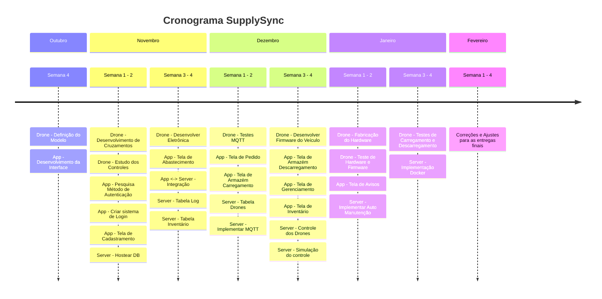
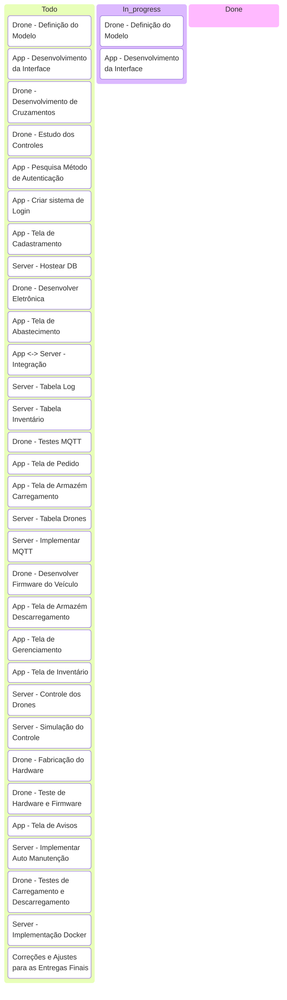

# Cronograma

Abaixo consta o planejamento de atividade dos integrantes da equipe.

## Timeline

```mermaid

timeline

    title Cronograma SupplySync
    section Outubro
        Semana 4: Drone - Definição do Modelo : App - Desenvolvimento da Interface

    section Novembro
        Semana 1 - 2: Drone - Desenvolvimento de Cruzamentos 
                    : Drone - Estudo dos Controles
                    : App - Pesquisa Método de Autenticação 
                    : App - Criar sistema de Login
                    : App - Tela de Cadastramento
                    : Server - Hostear DB

        Semana 3 - 4: Drone - Desenvolver Eletrônica
                    : App - Tela de Abastecimento
                    : App <-> Server - Integração
                    : Server - Tabela Log
                    : Server - Tabela Inventário

    section Dezembro
        Semana 1 - 2: Drone - Testes MQTT
                    : App - Tela de Pedido
                    : App - Tela de Armazém Carregamento
                    : Server - Tabela Drones
                    : Server - Implementar MQTT

        Semana 3 - 4: Drone - Desenvolver Firmware do Veículo
                    : App - Tela de Armazém Descarregamento
                    : App - Tela de Gerenciamento
                    : App - Tela de Inventário
                    : Server - Controle dos Drones
                    : Server - Simulação do controle

    section Janeiro
        Semana 1 - 2: Drone - Fabricação do Hardware
                    : Drone - Teste de Hardware e Firmware
                    : App - Tela de Avisos
                    : Server - Implementar Auto Manutenção

        Semana 3 - 4: Drone - Testes de Carregamento e Descarregamento
                    : Server - Implementação Docker

    section Fevereiro
        Semana 1 - 4: Correções e Ajustes para as entregas finais
```

## Kanban

```mermaid

---
config:
  kanban:
    ticketBaseUrl: 'https://supplysync.atlassian.net/browse/#TICKET#'
---
kanban
  Todo
    id1[Drone - Definição do Modelo]
    id2[App - Desenvolvimento da Interface]
    id3[Drone - Desenvolvimento de Cruzamentos]
    id4[Drone - Estudo dos Controles]
    id5[App - Pesquisa Método de Autenticação]
    id6[App - Criar sistema de Login]
    id7[App - Tela de Cadastramento]
    id8[Server - Hostear DB]
    id9[Drone - Desenvolver Eletrônica]
    id10[App - Tela de Abastecimento]
    id11[App <-> Server - Integração]
    id12[Server - Tabela Log]
    id13[Server - Tabela Inventário]
    id14[Drone - Testes MQTT]
    id15[App - Tela de Pedido]
    id16[App - Tela de Armazém Carregamento]
    id17[Server - Tabela Drones]
    id18[Server - Implementar MQTT]
    id19[Drone - Desenvolver Firmware do Veículo]
    id20[App - Tela de Armazém Descarregamento]
    id21[App - Tela de Gerenciamento]
    id22[App - Tela de Inventário]
    id23[Server - Controle dos Drones]
    id24[Server - Simulação do Controle]
    id25[Drone - Fabricação do Hardware]
    id26[Drone - Teste de Hardware e Firmware]
    id27[App - Tela de Avisos]
    id28[Server - Implementar Auto Manutenção]
    id29[Drone - Testes de Carregamento e Descarregamento]
    id30[Server - Implementação Docker]
    id31[Correções e Ajustes para as Entregas Finais]
    
  In_progress
    id1[Drone - Definição do Modelo]
    id2[App - Desenvolvimento da Interface]

  Done
```