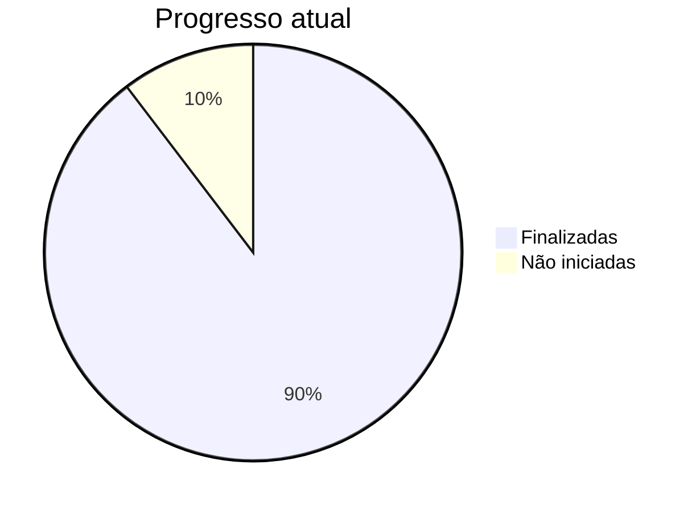

# Cronograma

Abaixo consta o planejamento de atividade dos integrantes da equipe.

## Timeline

## Atividades e acompanhamento

### Drone

- [X] Desenvolvimento de Cruzamentos 
- [X] Estudo dos Controles 
- [X] Desenvolver Eletrônica 
- [X] Testes MQTT
- [X] Desenvolver Firmware do Veículo
- [X] Fabricação do Hardware
- [X] Teste de Hardware e Firmware
- [X] Testes de Carregamento e Descarregamento

### App

- [X] Pesquisa Método de Autenticação 
- [X] Criar sistema de Login
- [X] Tela de Cadastramento
- [X] Tela de Abastecimento 
- [X] App <-> Server - Integração
- [X] Tela de Pedido 
- [X] Tela de Armazém Carregamento
- [X] Tela de Armazém Descarregamento
- [X] Tela de Gerenciamento
- [X] Tela de Inventário
- [X] Tela de Avisos

### Server

- [X] Hostear DB
- [X] App <-> Server - Integração
- [X] Tabela Log 
- [X] Tabela Inventário
- [X] Tabela Drones
- [X] Implementar MQTT 
- [X] Controle dos Drones
- [ ] Simulação do controle
- [ ] Implementar Auto Manutenção
- [ ] Implementação Docker

### Progresso

Última atualização: 27/11/2024

