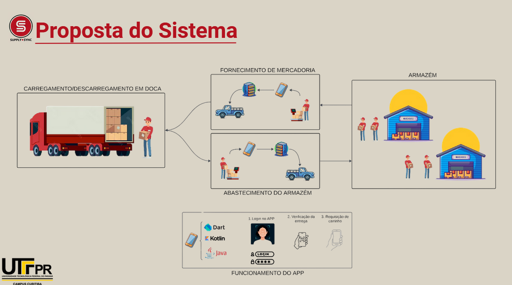
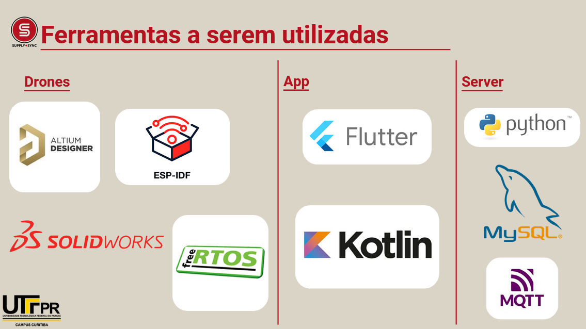

# SupplySync

Trabalho da matéria de Oficinas de Integração 2. Desenvolvimento de um sistema de gerenciamento de robôs dentro de um armazém para automatização de processos.

## Índice

- <a>Blog</a>
- <a href="https://github.com/IshikawaRasoto/SupplySync/tree/dev">Repositório e Código</a>
- <a>Cronograma</a>
- <a>Proposta</a>

## Inspiração e proposta

Usando como inspiração os sistemas utilizados pela Amazon e pelo Mercado Livre em seus armazéns com a utilização de robôs para transporte, a equipe pretende desenvolver um sistema que permite o transporte de itens dentro de um armazém de maneira quase automatizada, desenvolvendo tanto os drones e sua eletrônicas, além de um aplicativo para ser a interface com o usuário e um servidor para armazenar as informações e controlar os drones.

 

## Ferramentas a serem utilizadas

